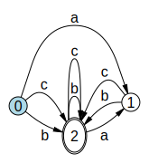

# :repeat_one: Automata: A lightweight library for Finite-State Automata 
[](https://www.nuget.org/packages/Automata.Core)   **Automata.Core** - Core library (zero-dependency library, optimal if you do not need visualization) 

[](https://www.nuget.org/packages/Automata.Visualization)  **Automata.Visualization** - Full library that also includes visualization and rendering of automata.

[](https://hexmerlin.github.io/Automata/index.html) **Documentation**

---

The **Automata** library provides functionality for working with finite-state automata.

:star: Example Features:
  - Create automata from regular expressions, sequences or other data.
  - Convert **NFAs** to **DFAs**.
  - Minimize **Automata** to optimal minimal representation.
  - Provides **Alang** (Automata Language) as an option for defining automata.
  - Perform operations on automata (union, intersection, difference, complement, etc.).
  - Visualize automata as graphs (Automata.Visualization).
---


---

## :hammer: Automata.Core - Core Library

The core library provides essential tools for finite-state automata operations.
It offers a lightweight and clean solution without visualization features.

### :bulb: C# Example: Create and Operate on Automata

The following example utilizes regular expressions written in `Alang`. 
`Alang` (**Automata Language**) is a language for defining automata using regular operations)
Read more about `Alang` in the  [Automata documentation](https://hexmerlin.github.io/Automata/index.html).
```csharp
// Compile a regex to a FSA (all sequences of {a, b, c} where any 'a' must be followed by 'b' or 'c')
var fsa = AlangRegex.Compile("(a? (b | c) )+");

// Compile two other automata
var test1 = AlangRegex.Compile("a b b c b");
var test2 = AlangRegex.Compile("a b a a b");

// Test the language overlap of the FSA with the two test regexes
Console.WriteLine(fsa.Overlaps(test1)); //output: true
Console.WriteLine(fsa.Overlaps(test2)); //output: false

```
---
## :framed_picture: Automata.Visualization: Automata.Core + Visualization
The Automata.Visualization library extends the core Automata functionality with visualization capabilities, utilizing MSAGL (Microsoft Automatic Graph Library) for layout .

:key: Key Features:
- All Automata.Core functionality.
- And: Visualize automata as graphs.

### :bulb: C# Full example program: Create an automaton and display it from a Console Application

```csharp
var fsa = AlangRegex.Compile("(a? (b | c) )+");  // Create an FSA from a regex

Console.WriteLine("Creating a minimal FSA and displaying it."); // Write some info to the console

Graph graph = fsa.CreateGraph(displayStateIDs: true); // Create a graph object (FSA with layout) 

GraphView graphView = GraphView.OpenNew(graph); // Open a new non-modal window that displays the graph

Console.WriteLine("FSA is displayed."); // Write some info to the console
```
---

## :blue_book: [Automata documentation](https://hexmerlin.github.io/Automata/index.html).

---

## :package:  NuGet package Installation

Install the packages via the .NET CLI or Package Manager in Visual Studio.

### Automata.Core
```bash
dotnet add package Automata.Core
```
### Automata.Visualization (includes Automata.Core)

```bash
dotnet add package Automata.Visualization
```
## :computer: Target Framework Compatibility

- **Automata.Core**: .NET 9.0 and later  
- **Automata.Visualization**: .NET 9.0 and later  
  - Requires Windows compile target `<TargetFramework>net9.0-windows</TargetFramework>` 

## :link: Dependencies

- **Automata.Core**:
  - None

- **Automata.Visualization**:
  - [**Automata.Core**](https://www.nuget.org/packages/Automata.Core)
  - [Microsoft.MSAGL](https://github.com/microsoft/automatic-graph-layout)

    These dependencies will be automatically installed when you install `Automata.Visualization` via NuGet.

## :scroll: License

This project is licensed under the [MIT License](https://opensource.org/licenses/MIT).
