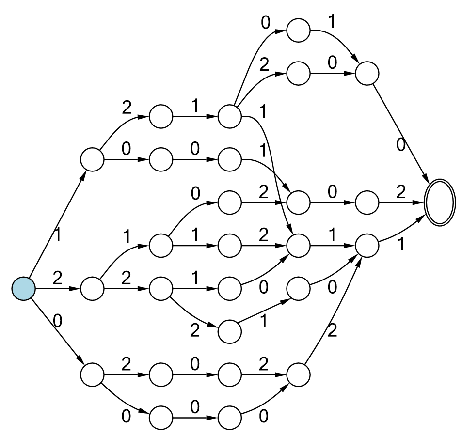

# :repeat_one: Automata: A lightweight library for Finite-State Automata 
[](https://www.nuget.org/packages/Automata.Core)   **Automata.Core** - Core library (zero-dependency library, optimal if you do not need visualization) 

[](https://www.nuget.org/packages/Automata.Visualization)  **Automata.Visualization** - Full library that also includes visualization and rendering of automata.

[](https://hexmerlin.github.io/Automata/index.html) **API Documentation**

---

The **Automata** library provides functionality for working with finite-state automata.

:star: Example Features:
  - Create **NFAs** (Non-deterministic Finite Automata) from sequences or other data.
  - Convert **NFAs** to **DFAs** (Deterministic Finite Automata).
  - Minimize **Automata** to reduce states while preserving functionality.
---

## :memo: Source Code

Find the source code on GitHub:  
[Automata GitHub Repository](https://hexmerlin.github.io/Automata)

---

---

## :hammer: Automata.Core - Core Library

The core library provides essential tools for finite-state automata operations.
It offers a lightweight and clean solution without visualization features.

### :bulb: C# Example: Create and Manipulate Automata
```csharp

Random random = new Random(7);
var sequences = Enumerable.Range(0, 10).Select(_ => Enumerable.Range(0, 8).Select(_ => random.Next(4).ToString())); //Create some random string sequences

IFsa fsa = new Nfa(sequences).ToCfa(); //Create a canonical minimized automaton from the sequences

```
---
## :framed_picture: Automata.Visualization: Automata.Core + Visualization
The Automata.Visualization library extends the core Automata functionality with visualization capabilities, powered by MSAGL (Microsoft Automatic Graph Library).

:key: Key Features:
- Visualize automata as graphs.
- Includes all core Automata functionality.

### :bulb: C# Full example program: Create an automaton and display it from a Console app

```csharp
        Console.WriteLine("Creating graph."); // Write some text output to the console window

        Random random = new Random(7);
        var sequences = Enumerable.Range(0, 10).Select(_ => Enumerable.Range(0, 8).Select(_ => random.Next(4).ToString())); //Create some random string sequences

        IFsa fsa = new Nfa(sequences).ToCfa(); //Create a canonical minimized automaton from the sequences

        Graph graph = fsa.CreateGraph(); // Create a displayable graph object (FSA wih layout)

        //Graph graph = sequences.CreateGraph(); //Alternatively you can use this command, to replace the 2 lines above

        GraphView graphView = GraphView.OpenNew(graph); // Open a new non-modal interactive window that displays the graph in it

        Console.WriteLine("Graph is displayed."); // Write some text output to the console window
```
---

## :package:  NuGet package Installation

Install the packages via the .NET CLI or Package Manager in Visual Studio.

### Automata.Core
```bash
dotnet add package Automata.Core
```
### Automata.Visualization (includes Automata.Core)

```bash
dotnet add package Automata.Visualization
```
## :computer: Target Framework Compatibility

- **Automata.Core**: .NET 9.0 and later  
- **Automata.Visualization**: .NET 9.0 and later  

## :link: Dependencies

- **Automata.Core**:
  - None

- **Automata.Visualization**:
  - [**Automata.Core**](https://www.nuget.org/packages/Automata.Core)
  - [Microsoft.MSAGL](https://github.com/microsoft/automatic-graph-layout)

    These dependencies will be automatically installed when you install `Automata.Visualization` via NuGet.

## :scroll: License

This project is licensed under the [MIT License](https://opensource.org/licenses/MIT).
